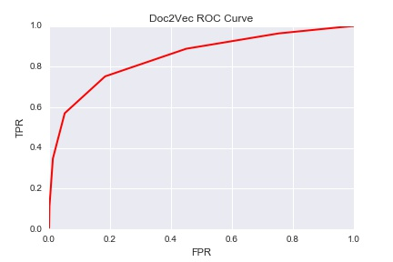

# TweetSafe
---

TweetSafe is a Doc2Vec model used to classify tweets as either offensive or not. TweetSafe was trained on select subreddits from the May 2015 Reddit corpus where the subreddit labels were used as a proxy for offensive or not offensive. A separate twitter hate speech dataset was used to tune TweetSafe. After building and tuning the model, TweetSafe was compared to a TF-IDF based approach that used XGboost. A website was built that allows users to experiment with TweetSafe by inputing a string and seeing the results of the model.  

### Table Of Contents:

- [Motivation](https://github.com/mgupta011235/TweetSafe#motivation)
- [Data](https://github.com/mgupta011235/TweetSafe#data)
- [Doc2Vec Model](https://github.com/mgupta011235/TweetSafe#doc2vec)
- [TF-IDF Model](https://github.com/mgupta011235/TweetSafe#motivation)
- [Model Comparison](https://github.com/mgupta011235/TweetSafe#motivation)
- [Website](https://github.com/mgupta011235/TweetSafe#motivation)
- [Assumptions](https://github.com/mgupta011235/TweetSafe#motivation)
- [References](https://github.com/mgupta011235/TweetSafe#motivation)
- [Acknowledgements](https://github.com/eyspahn/OnlineHateSpeech#acknowledgements)

## Motivation

The motivation for this project was based on two potential business applications for social media:

- **Tracking Abusive Users** Websites such as Twitter and Facebook have trouble detecting abusive users due to the huge volume of information that flows through the site at any give time. TweetSafe has the ability to sift through millions of comments in minutes and flag abusive users. Instead of having to read millions of comments, site administrators can focus on a few hundred users to determine if further action is needed.  

- **Filter Offensive Comments** We all know not to say offensive things on social media but sometimes a bad comment slips through. That single comment can destroy your career or company. TweetSafe can prevent this from happening by warning you that your comment may be offensive before you post it.

## Data

There were two datasets used in this project. The training set came from selected subreddits from the May 2015 reddit data dump. This dataset is avaible from [Kaggle]( https://www.kaggle.com/c/reddit-comments-may-2015 ) as a Sqlite database. The subreddits were selected so that the model would see offensive and not offensive comments on the same subject. For example, both /r/TheRedPill and /r/women were selected because they discuss woman's rights. However /r/TheRedPill is extremely misogynistic while /r/women is not.

Table of final offensive and not offensive subreddits used:

| Category | Subreddit Name | Number of comments|
|:----: | :---: | :----: |
| Offensive | /r/CoonTown | 51979 |
| Offensive  | /r/WhiteRights | 1352 |
| Offensive | /r/Trans_fags | 2362 |
| Offensive | /r/SlutJustice | 309 |
| Offensive | /r/TheRedPill | 59145 |
| Offensive | /r/KotakuInAction | 128156 |
| Offensive | /r/IslamUnveiled | 5769 |
| Offensive | /r/GasTheKikes | 919 |
| Offensive | /r/AntiPOZi | 4740 |
| Offensive | /r/fatpeoplehate | 311183 |
| Offensive | /r/TalesofFatHate | 5239 |
| Not Offensive | /r/politics | 244927 |
| Not Offensive | /r/worldnews | 490354 |
| Not Offensive | /r/history | 25242 |
| Not Offensive | /r/blackladies | 4396 |
| Not Offensive| /r/lgbt | 8253 |
| Not Offensive | /r/TransSpace | 472 |
| Not Offensive | /r/women | 529 |
| Not Offensive | /r/TwoXChromosomes | 105130 |
| Not Offensive | /r/DebateReligion | 41015 |
| Not Offensive | /r/religion | 2623 |
| Not Offensive | /r/islam | 25443 |
| Not Offensive | /r/Judaism | 9103 |
| Not Offensive | /r/BodyAcceptance | 579 |
| Not Offensive | /r/AskMen | 138839 |
| Not Offensive | /r/AskWomen | 137889 |

The second dataset was labeled Twitter hate speech dataset from [Crowdflower](https://www.crowdflower.com/data-for-everyone/). This dataset was split into a validation set and test set. The validation set was used to tune the hyper parameters for both models. The Twitter hate speech dataset was split so that there would be a even class balance in both the validation and test set.

Table of comment distribution in validation and test set:

| Category | Dataset | Number of comments|
|:----: | :---: | :----: |
| Offensive | Validation Set | 5034 |
| Not Offensive | Validation Set | 4966 |
| Offensive | Test Set| 2091 |
| Not Offensive | Test Set| 2084 |
 

## Doc2Vec Model

### Tokenization

Because doc2vec uses surrounding words to predict words, features such as ending, punctuations and the case of a word are extremely important. The tokenization procedure outlined below was designed so as to maximize the information taken from the comment while minimizing the noise.

1. All numbers were converted to NUM_TAG
2. All subreddit mentions were converted to SUBREDDIT_TAG
3. All reddit user mentions were converted to USER_TAG
4. ['!','@','#','$',"%","^","&","*",":","\\", "(",")","+","=","?","\'","\"",";","/", "{","}","[","]","<",">","~","`","|"] were converted to tokens
5. Split on spaces

### Training

Table of doc2vec model parameters:

| Parameter | Value |Notes|
|:----: | :---: | :----: |
| dm | 0 | distributed bag of words model |
| size | 300 | number of feature vecotors |
| negative | 5 | number of noise words |
| hs | 0| no hierarchical sampling |
| min_count | 2 | ignore words that appear less than twice |
| sample | 1e-5 | threshold for configuring which higher-frequency words are randomly downsampled |
| window | 15 | maximum distance between the predicted word and context words used for prediction within a document |
| workers | 4 | number of cores |
| Epochs | 10 | number of training epochs |

### Hyperparameter Tuning

The doc2vec model determines whether a tweet is offensive or not by calculating the ratio of offensive to not offensive subreddits from a list of similar subreddits. Subreddit The number of similar subreddits found using cosine similarity (k) and the ratio of offensive to not offensive subreddits (threshold) were hyperparmeters that needed to be set. These hyperparmeters were found by maximizing the area under the curve (AUC) of the ROC curve produced by the model.

Table of hyperparmeters:

| Hyperparameter | Value |
|:----: | :---: |
| k | 11 |
| threshold | 0.63 |

Using k = 11 and threshold = 0.63 produced a ROC curve with an area of 0.85. This curve was produced using the validation set.

## TF-IDF Model

### Tokenization

Unlike doc2vec, tf-idf is only interested in the frequency at which a word appears in a corpus. Hence, stemming and punctuation removal is necessary. The snowball stemmer and word_tokenize functions from nltk were applied to tokenize the reddit comments before training.

### Training

Xgboost was used to train the tf-idf model. The resulting feature matrix from tf-idf was extremely large and required a memory optimized instance on Amazon Web Services in order to train xgboost on it.

### Hyperparameter Tuning

As with doc2vec, the hyperparameters of xgboost were chosen such that they maximized the AUC of the ROC curve produced by the model.

Table of hyperparmeters parameters:

| Parameter | Value |
|:----: | :---: |
| max_depth | 4 |
| eta | 0.3 |
| num_round | 163 |

The above ROC curve was calculated on the validation set. The AUC of this is 0.86.

## Model Comparison

## Website

## Assumptions

There are a whole lot of assumptions in this analysis.

#### Labeling Hate
The biggest assumption I'm making has to do with labeling the data as hateful or not.

In this analysis, I used the subreddit the comment came from as the marker as hateful or not hateful. The benefit of this approach is that nobody needs to expose themselves to potentially hateful speech. However, this is not a very rigorous approach--that is, there are likely many comments which would not be considered hateful other than appearing in one of the hateful subreddits.

I relied on the assumption that hateful and not-hateful data would both contain controversial information and back-and-forth exchanges between members. This may account for irony and sarcasm as well, if those appear in both hateful and not hateful subreddits.

#### Multiple simultaneous categories are not accounted for;
The categorization may be fluid as well. Certainly, people can express hate in multiple dimensions simultaneously (e.g. "That chink bitch"), but this model will only predict one category.

In the above example, I suspect that since there are more hateful comments in the gender category to train the model, that is the category the model will predict.

#### Potentially incorrect categorization
I included hateful speech regarding sexual orientation as part of hateful speech against gender. This is not entirely appropriate, but the relatively small number of hateful comments I found against sexual orientation, combined with expected conflation between gender and sexual orientation by those who are hateful against them, made me feel grudgingly comfortable including sexual orientation into the gender hate category.

#### Selecting Subreddits
I selected the subreddits manually. I researched what potentially hateful subreddits were, starting with some googling. Among the sources were news articles which discussed the revision of anti-harassment policy in the months after May 2015, which I took to be a good indicator of potential hate speech.

I started with a list of about 70 potientially hateful  subreddits. I examined these subreddits in the May 2015 comments database, and checked that the subreddit had more than 100 comments and that it was actually a hateful subreddit. These led me to the final list of
11 hateful subreddits with over 500,000 comments in them.

I then wanted to choose subreddits which would cover similar content while being strictly moderated to remove any hateful speech. I also wanted to include some general subreddits which would have a lot of arguments and cover general non-hateful speech. This let me to the final list of non-hateful subreddits, of just over a million comments.

#### The labeling approach not taken:
A more rigorous way to approach labeling is to use crowdsourcing tools like Amazon Mechanical Turk or Crowdflower, to have people read and label comments individually. I had pursued this approach; however, I wasn't satisfied with this system for the project. There were two main reasons: the initial model based on the subreddit labeling method performed better than I expected, and also the costs for manual labeling

The main reason this approach was abandoned was cost concerns--without a budget for the project, I wanted to keep costs minimal.

It cost about $8 for a set of 100 comments to be labeled three times by different people. Of these, nearly 2/3 were labeled as "not hateful," despite the comments originating from only hateful subreddits and screening for comment length. Continuing at this rate, it would be over $100 for a corpus of 2000 labeled comments, of which perhaps a third would be considered hateful.

#### Speech is not uniform

Another large assumption is that the hate speech encountered on reddit is similar to hate speech in general. This may be very wrong--it may be that there are site-specific or subreddit-specific phrases the subreddit(s) involved, not hate speech generally. For example, on /r/fatpeoplehate, the term "hamplanet" was often used when discussing larger-shaped people. This term appears to originate, or at least be popularized by reddit, though Urban Dictionary's definitions do not reference the site.

## References

## Acknowledgements

- My instructors & peers in the Galvanize Data Science Immersive program.
- Reddit user Stuck_In_the_Matrix for originally scraping & posting the comments. His/her post originally got me thinking about the possibilities in the reddit comment data set.
- Kaggle for hosting the May 2015 comments in a convenient format.
- Reddit user fhoffa for uploading the comments to google big query for easy web-based access of comments
- The people who have spent time developing sci-kit learn, NLP, XGBoost and the many tools I relied on.
