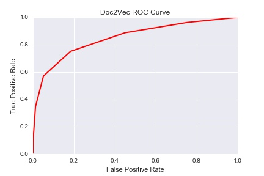
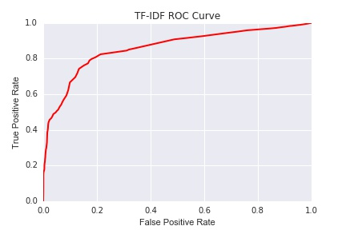
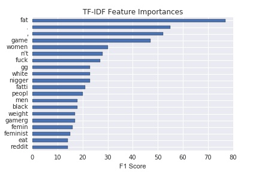
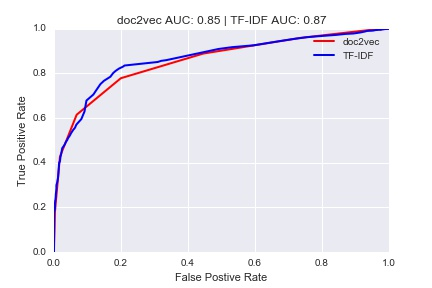
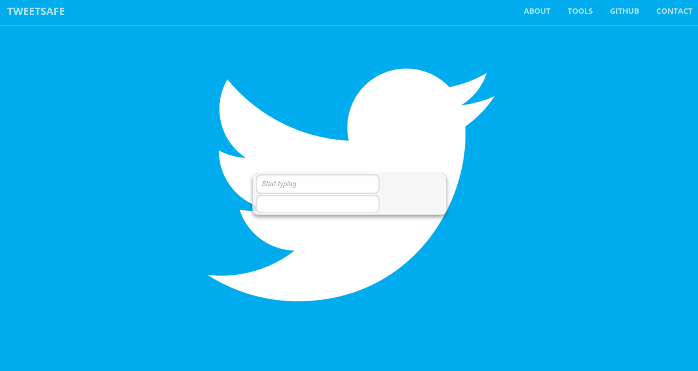
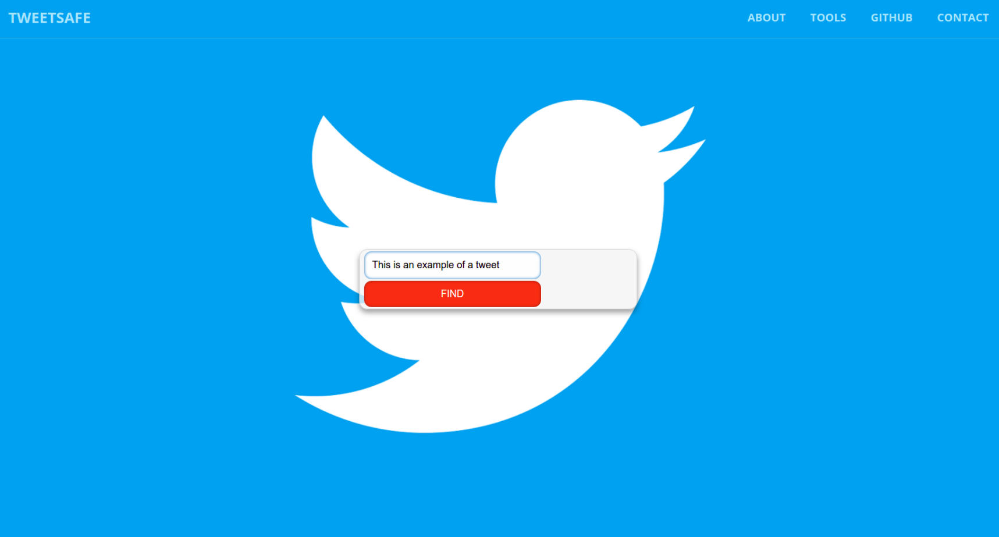
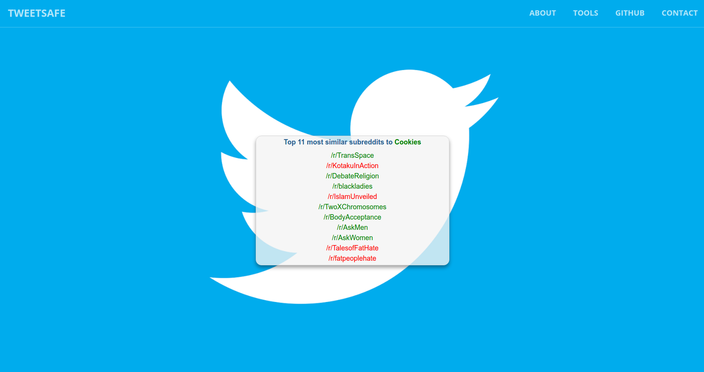
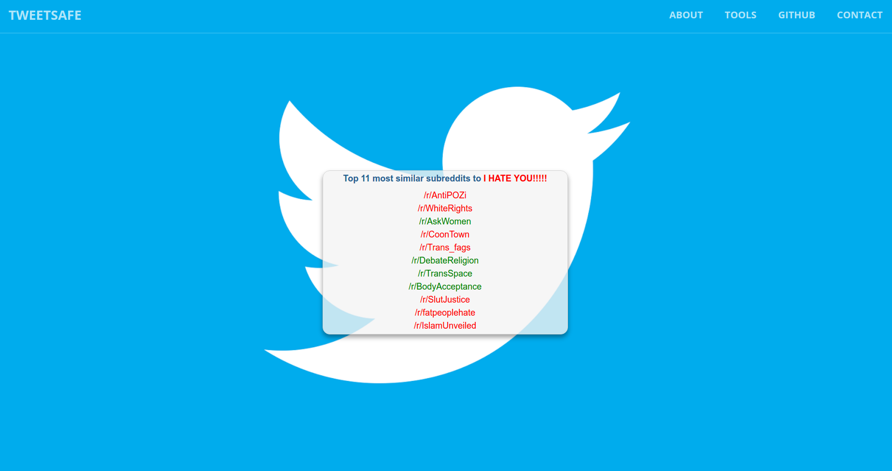

# TweetSafe
---

TweetSafe is a Doc2Vec model used to classify tweets as either offensive or not. TweetSafe was trained on select subreddits from the May 2015 Reddit corpus where the subreddit labels were used as a proxy for offensive or not offensive. A separate twitter hate speech dataset was used to tune TweetSafe. After building and tuning the model, TweetSafe was compared to a TF-IDF based approach that used XGboost. A website was built that allows users to experiment with TweetSafe by inputing a string and seeing the results of the model.  

### Table Of Contents:

- [Motivation](https://github.com/mgupta011235/TweetSafe#motivation)
- [Data](https://github.com/mgupta011235/TweetSafe#data)
- [Doc2Vec Model](https://github.com/mgupta011235/TweetSafe#doc2vec-model)
- [TF-IDF Model](https://github.com/mgupta011235/TweetSafe#tf-idf-model)
- [Model Comparison](https://github.com/mgupta011235/TweetSafe#model-comparison)
- [Website](https://github.com/mgupta011235/TweetSafe#website)
- [Acknowledgements](https://github.com/mgupta011235/TweetSafe#acknowledgements)

## Motivation

The motivation for this project was based on two potential business applications for social media:

- **Tracking Abusive Users** Websites such as Twitter and Facebook have trouble detecting abusive users due to the huge volume of information that flows through the site at any give time. TweetSafe has the ability to sift through millions of comments in minutes and flag abusive users. Instead of having to read millions of comments, site administrators can focus on a few hundred users to determine if further action is needed.  

- **Filter Offensive Comments** We all know not to say offensive things on social media but sometimes a bad comment slips through. That single comment can destroy your career or company. TweetSafe can prevent this from happening by warning you that your comment may be offensive before you post it.

## Data

There were two datasets used in this project. The training set came from selected subreddits from the May 2015 reddit data dump. This dataset is avaible from [Kaggle]( https://www.kaggle.com/c/reddit-comments-may-2015 ) as a Sqlite database. The subreddits were selected so that the model would see offensive and not offensive comments on the same subject. For example, both /r/TheRedPill and /r/women were selected because they discuss woman's rights. However /r/TheRedPill is extremely misogynistic while /r/women is not.

Table of final offensive and not offensive subreddits used:

| Category | Subreddit Name | Number of comments|
|:----: | :---: | :----: |
| Offensive | /r/CoonTown | 51979 |
| Offensive  | /r/WhiteRights | 1352 |
| Offensive | /r/Trans_fags | 2362 |
| Offensive | /r/SlutJustice | 309 |
| Offensive | /r/TheRedPill | 59145 |
| Offensive | /r/KotakuInAction | 128156 |
| Offensive | /r/IslamUnveiled | 5769 |
| Offensive | /r/GasTheKikes | 919 |
| Offensive | /r/AntiPOZi | 4740 |
| Offensive | /r/fatpeoplehate | 311183 |
| Offensive | /r/TalesofFatHate | 5239 |
| Not Offensive | /r/politics | 244927 |
| Not Offensive | /r/worldnews | 490354 |
| Not Offensive | /r/history | 25242 |
| Not Offensive | /r/blackladies | 4396 |
| Not Offensive| /r/lgbt | 8253 |
| Not Offensive | /r/TransSpace | 472 |
| Not Offensive | /r/women | 529 |
| Not Offensive | /r/TwoXChromosomes | 105130 |
| Not Offensive | /r/DebateReligion | 41015 |
| Not Offensive | /r/religion | 2623 |
| Not Offensive | /r/islam | 25443 |
| Not Offensive | /r/Judaism | 9103 |
| Not Offensive | /r/BodyAcceptance | 579 |
| Not Offensive | /r/AskMen | 138839 |
| Not Offensive | /r/AskWomen | 137889 |

The second dataset was labeled Twitter hate speech dataset from [Crowdflower](https://www.crowdflower.com/data-for-everyone/). This dataset was split into a validation set and test set. The validation set was used to tune the hyper parameters for both models. The Twitter hate speech dataset was split so that there would be a even class balance in both the validation and test set.

Table of comment distribution in validation and test set:

| Category | Dataset | Number of comments|
|:----: | :---: | :----: |
| Offensive | Validation Set | 5034 |
| Not Offensive | Validation Set | 4966 |
| Offensive | Test Set| 2091 |
| Not Offensive | Test Set| 2084 |
 

## Doc2Vec Model

### Tokenization

Because doc2vec uses surrounding words to predict words, features such as ending, punctuations and the case of a word are extremely important. The tokenization procedure outlined below was designed so as to maximize the information taken from the comment while minimizing the noise.

1. All numbers were converted to NUM_TAG
2. All subreddit mentions were converted to SUBREDDIT_TAG
3. All reddit user mentions were converted to USER_TAG
4. ['!','@','#','$',"%","^","&","*",":","\\", "(",")","+","=","?","\'","\"",";","/", "{","}","[","]","<",">","~","`","|"] were converted to tokens
5. Split on spaces

### Training

Table of doc2vec model parameters:

| Parameter | Value |Notes|
|:----: | :---: | :----: |
| dm | 0 | distributed bag of words model |
| size | 300 | number of feature vecotors |
| negative | 5 | number of noise words |
| hs | 0| no hierarchical sampling |
| min_count | 2 | ignore words that appear less than twice |
| sample | 1e-5 | threshold for configuring which higher-frequency words are randomly downsampled |
| window | 15 | maximum distance between the predicted word and context words used for prediction within a document |
| workers | 4 | number of cores |
| Epochs | 10 | number of training epochs |

### Hyperparameter Tuning

The doc2vec model determines whether a tweet is offensive or not by calculating the ratio of offensive subreddits from a list of similar subreddits. The number of similar subreddits found using cosine similarity (k) and the ratio of offensive subreddits (threshold) were hyperparmeters that needed to be set. These hyperparmeters were found by maximizing the area under the curve (AUC) of the ROC curve produced by the model.

Table of hyperparmeters:

| Hyperparameter | Value |
|:----: | :---: |
| k | 11 |
| threshold | 0.63 |

Using k = 11 and threshold = 0.63 produced a ROC curve with an area of 0.85. This curve was produced using the validation set.

## TF-IDF Model

### Tokenization

Unlike doc2vec, tf-idf is only interested in the frequency at which a word appears in a corpus. Hence, stemming and punctuation removal is necessary. The snowball stemmer and word_tokenize functions from nltk were applied to tokenize the reddit comments before training.

### Training

Xgboost was used to train the tf-idf model. The resulting feature matrix from tf-idf was extremely large and required a memory optimized instance on Amazon Web Services in order to train xgboost on it.

### Hyperparameter Tuning

As with doc2vec, the hyperparameters of xgboost were chosen such that they maximized the AUC of the ROC curve produced by the model.

Table of hyperparmeters parameters:

| Parameter | Value |
|:----: | :---: |
| max_depth | 4 |
| eta | 0.3 |
| num_round | 163 |

The above ROC curve was calculated on the validation set. The AUC of this is 0.86.

This graph displays the top 20 most important features that xgboost split on.

Since the model is interested in detecting hateful language it isn't surprising that "fat" is the most important feature that xgboost is splitting on. What is surprising is that "." and "," were the next two important features. This implies that the model is looking at the grammatical structure of the tweet in addition to the words in the tweet. This approach makes intuitive sense because there is a strong correlation between weak grammatical structure and offensive comments.

Another interesting top feature is "gg". This stands for "good game" and is said at the end of online gaming competitions such as DOTA or LOL. Chat logs in these online games are notorious for their vulgar and obscene language. The model is most likely picking up on this strong connection, hence making it a good split for information gain.  

## Model Comparison

Both models were compared by looking at the ROC curve each model produced on the test data. Both models did well on the test data, covering more than 80% of the area. However TF-IDF (87%) did a little bit better than the doc2vec (85%).  

While it may be tempting to say that TF-IDF approach is better, the opposite is true. The essential flaw behind TF-IDF is that it doesn't incorporate the meanings of the word. This meaning is lost through stopword removal and stemming. Instead it tries to infer meanings purely through the frequency of the stemmed word. Nonetheless it is surprising how well TF-IDF can do giving it's inherent shortcoming.

A word embedding approach such as doc2vec is a more natural choice because it learns word vectors that incorporate the meaning of the word. This way the model can infer the intent behind the tweet. For example, the tweet *"I believe African Americans have less rights"* is classified as offensive even though none of the individual words are offensive.

Another example of the advantage of a word embedding approach is this recent Donald Trump tweet: *"PAY TO PLAY POLITCS #CrookedHillary"*. This message is classified as offensive. However, when the caps are removed the tweet is classified as not offensive. This is very interesting because it shows that the model has learned that all caps (yelling) is offensive.

## Website

Website [Link](http://tweetsafe.us-east-1.elasticbeanstalk.com/)

A website was created using the doc2vec model. The website starts at a home page where the user can enter a tweet and see if it's offensive (red) or not (green). The list of similar subreddits will appear below the tweet and are colored red if they are offensive, green for not offensive

Home Page: this is the home page

Entering a Tweet: A user enters a tweet and clicks find

A Good Tweet: if the tweet is not offensive than it will show up as green. Below the tweet are the 11 most similar subreddits to that tweet

A Bad Tweet: if the tweet is offensive than it will show up as red.

## Acknowledgements

*If I have seen farther it is by standing on the shoulders of Giants.*

-Issac Newton

I'm extremely proud of the work that I've produced for my capstone project. However there is no way I would have been able to do so much in two weeks if it weren't for the following people.

- [Emily Y. Spahn](https://github.com/eyspahn/OnlineHateSpeech): For her brilliant idea of using subreddit labels as a proxy for offensiveness. Her work was the basis for my project.
- [Jose Marcial Portilla](https://github.com/jmportilla/Reddit2Vec): For using doc2vec to predict subreddit labels.
- My instructors Lee Murray, Darren Reger and Ivan Corneillet
- My DSR Nathanael Robertson
- The creators of [gensim](https://en.wikipedia.org/wiki/Gensim) for creating an amazing python implementation of doc2vec
